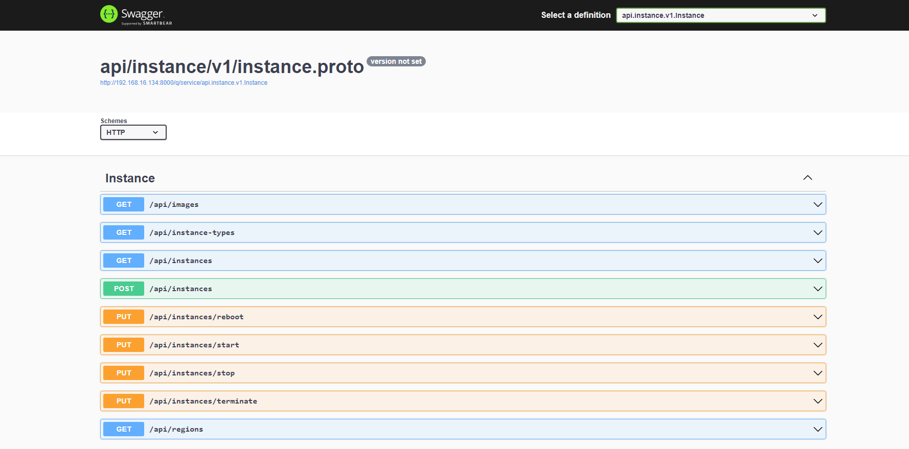
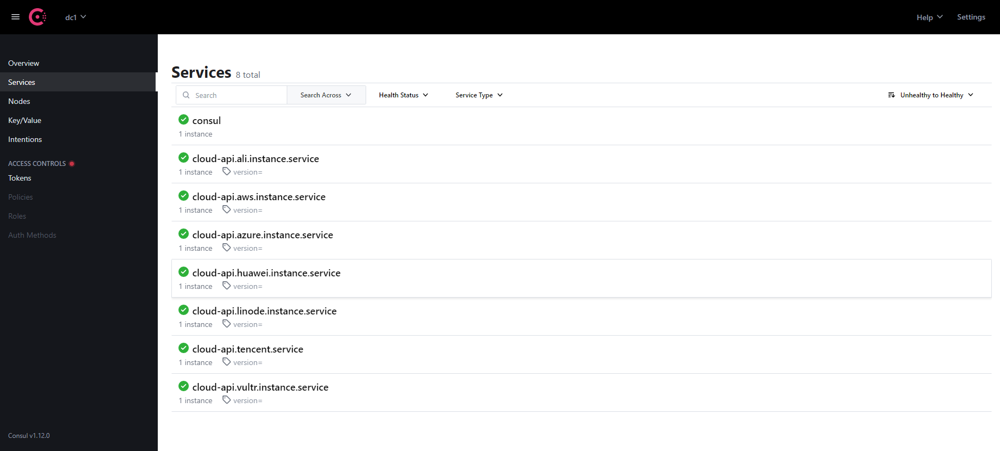
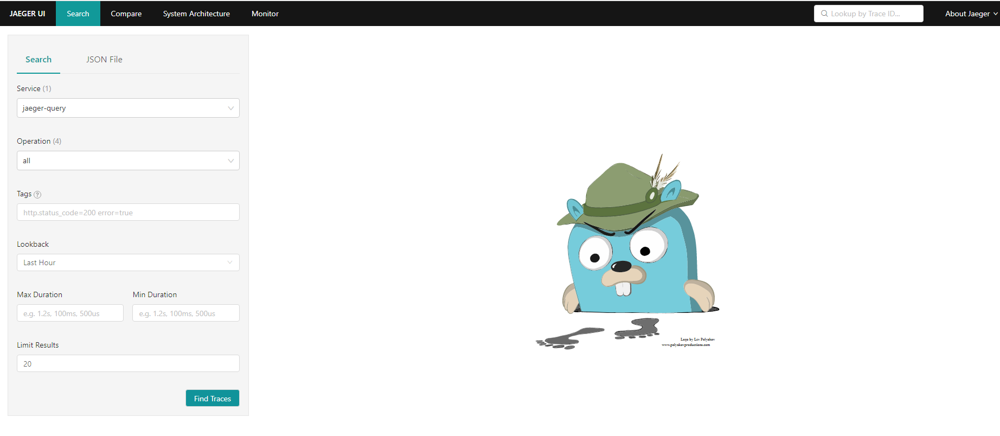

# cloud-api

## About cloud-api

This is an API that can manage（Create、List、Start、Stop、Reboot、Delete） Aliyun、Tencent Cloud、Huawei Cloud、AWS、Azure、Vultr、Linode instances. __To avoid risks, it is recommended to use it locally.__

## Getting Started

```shell
$ git clone https://github.com/trumanwong/cloud-api.git
$ cd cloud-api/scripts
$ sudo docker-compose up -d
```

## Examples

[Aliyun Examples](./services/ali/README.md).

[Tencent Cloud Examples](./services/tencent/README.md).

[Huawei Cloud Examples](./services/huawei/README.md).

[AWS Examples](./services/aws/README.md).

[Azure Examples](./services/azure/README.md).

[Vultr Examples](./services/vultr/README.md).

[Linode Examples](./services/linode/README.md).

## OpenAPI Swagger

Open /q/swagger-ui/ in Web Browser in order to access Swagger UI.

### Usage

Visit http://127.0.0.1:8000/q/swagger-ui access aliyun swagger ui. follows:



## Consul

Visit http://127.0.0.1:8500 access consul ui. follows:



## Jaeger

Visit http://127.0.0.1:16686 access jaeger ui. follows:



## Acknowledgments

* [go-kratos/kratos](https://github.com/go-kratos/kratos)  is a microservice-oriented governance framework implemented by golang.
* [hashicorp/consul](https://github.com/hashicorp/consul)  is a distributed, highly available, and data center aware solution to connect and configure applications across dynamic, distributed infrastructure.
* [jaegertracing/jaeger](https://github.com/jaegertracing/jaeger), inspired by Dapper and OpenZipkin, is a distributed tracing platform created by Uber Technologies and donated to Cloud Native Computing Foundation.